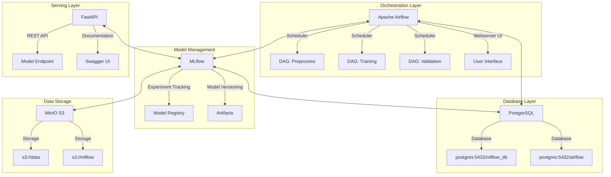
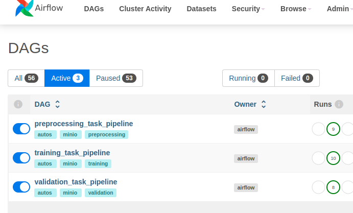
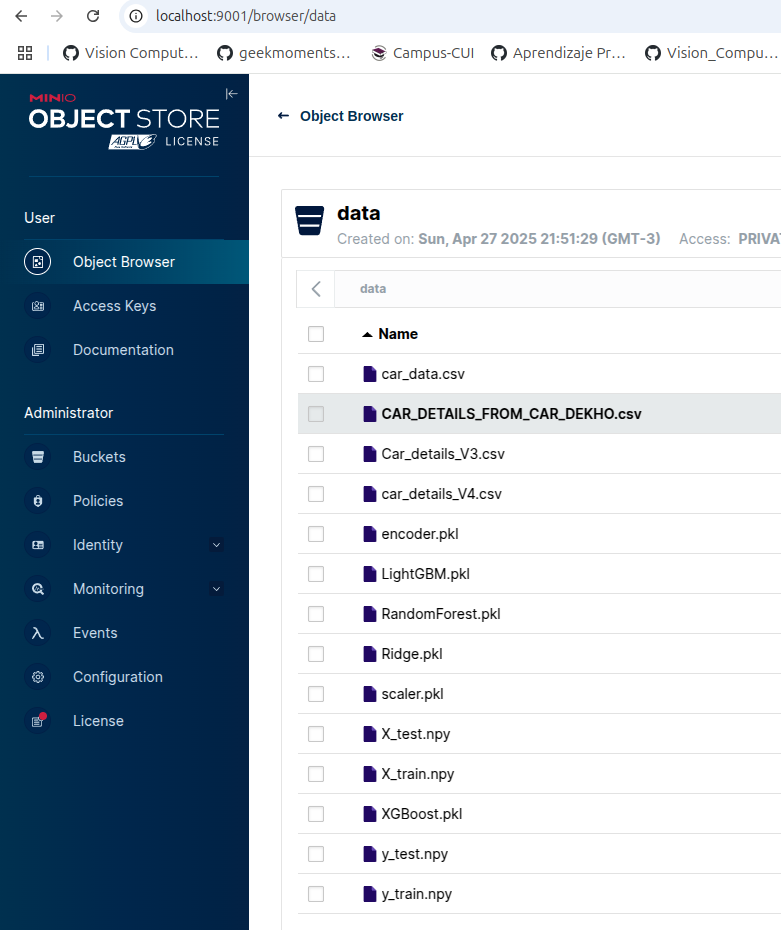
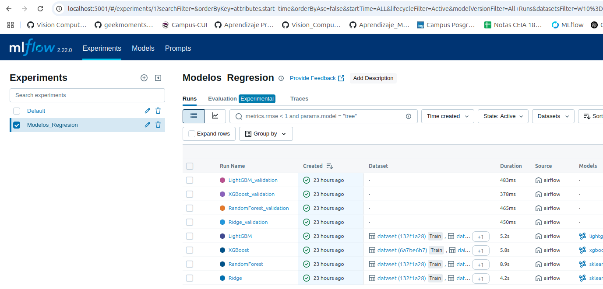
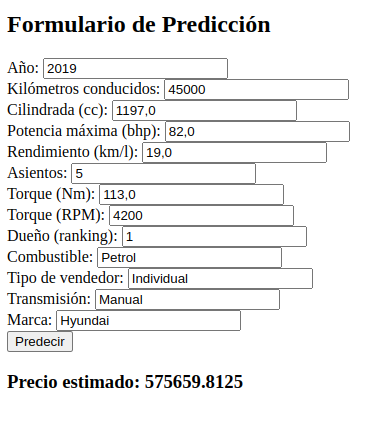

# Sistema MLOps para Predicción de Precios de Vehículos
### MLOps1 - CEIA - FIUBA

Estructura de servicios para implementación de un sistema completo de MLOps para predicción de precios de vehículos.

## Grupo de Trabajo
- Nicolas Pinzon Aparicio (a1820)
- Daniel Fernando Peña Pinzon (a1818)
- Cesar Raúl Alan Cruz Gutierrez (2544003)
- Federico Martin Zoya (a1828)

## Descripción del Proyecto

Este proyecto implementa un ambiente productivo para MLOps que consta de varios servicios desplegados mediante contenedores:

- **Apache Airflow**: Orquestación del pipeline ML (preprocesamiento, entrenamiento y validación)
- **MLflow**: Seguimiento de experimentos, registro y gestión de modelos
- **FastAPI**: API REST para servir modelos en producción
- **MinIO**: Almacenamiento compatible con S3 (data lake)
- **PostgreSQL**: Base de datos para Airflow y MLflow



## Requisitos Previos

- [Docker](https://docs.docker.com/engine/install/) y Docker Compose
- Git

## Instalación y Ejecución de Servicios

1. Clonar este repositorio:
   ```bash
   git clone https://github.com/Grupo4FIUBA/AMQ2_TF.git
   cd AMQ2_TF
   ```
2. Configurar el ID de usuario (solo para Linux/MacOS):
   - Editar el archivo `.env`
   - Reemplazar `AIRFLOW_UID` con tu ID de usuario: `id -u`

3. Iniciar todos los servicios que se encuentran en contenedores mediante el comando:
   ```bash
   docker compose --profile all up
   ```

4. Acceso a los servicios:
   - **Apache Airflow**: http://localhost:8080 (usuario: airflow, contraseña: airflow)
   - **MLflow**: http://localhost:5001
   - **MinIO**: http://localhost:9001 (usuario: minio, contraseña: minio123)
   - **API**: http://localhost:8800/
   - **Documentación API**: http://localhost:8800/docs

5. Copia manual de los archivos correspondientes a las bases de datos de los precios de vehículos en el bucket de Minio denominado "data":
    Los archivos se encuentran en ./Datasets y corresponden a los cuatro archivos de texto plano .cvs. El preprocesamiento, por cuestiones 
    referidas a cantidad de registros válidos y calidad de los datos, será efectuado únicamente sobre el archivo Car_details_V3.csv. 

## Pipeline de Datos y ML

El sistema implementa un flujo de trabajo completo en Airflow para la predicción de precios de vehículos en línea, conformado básicamente por 3 Dags, los cuales deberán ser ejecutados respetando el correspondiente orden:

1. **Dag de Preprocesamiento: preprocessing_task_pipeline**: Limpieza y transformación de los datos del dataset de trabajo correspondiente a precios de vehículos publicados en un portal de India.

    1. load_data_task():
            Llama a load_datasets() y selecciona el dataset 'car_details_v3'.

            Lo convierte en JSON para pasarlo entre tareas (Airflow pasa texto entre steps).

    2. basic_cleaning_task(df_json):
            Reconstruye el DataFrame desde el JSON.

            Aplica basic_cleaning() y lo devuelve como JSON.

    3. prepare_data_task(df_clean_json):
            Reconstruye el DataFrame limpio.

            Llama a prepare_data().

            Sube X_train, y_train, X_test, y_test como .npy a MinIO.
    

2. **Dag de Entrenamiento: training_task_pipeline**: Entrenamiento de modelos XGBoost, LightGBM, RandomForest y Ridge. 

    1. Inicialización:
            Se crea el cliente S3 y se inicializa el logger.

    2. Carga de datos:
            Se descargan X_train.npy y y_train.npy desde MinIO (datos ya preprocesados y serializados).

    3. Modelos a entrenar:
            Se definen 4 modelos distintos:

            Ridge (regresión lineal con regularización L2).

            Random Forest.

            XGBoost.

            LightGBM.

    4. Configuración de MLflow:
            Se apunta al servidor MLflow (http://mlflow:5001).

            Se busca o crea un experimento llamado "Modelos Regresion Entrenados".

    5. Entrenamiento de cada modelo:
            Para cada modelo:

            Se inicia un run en MLflow.

            Se entrena el modelo sobre X_train y y_train.

            Se calculan métricas: R² y RMSE.

            Se registran parámetros y métricas (automáticamente con mlflow.autolog() y manualmente por redundancia).

            Se guarda el modelo como .pkl.

            Se sube el modelo a MinIO.

            Se registra el modelo en MLflow según su tipo (para facilitar luego su recuperación o deployment).

    6. Logging de errores:
            Cualquier excepción durante este proceso se loguea en el archivo training.log y se imprime por consola.

3. **Dag de Validación: validation_task_pipeline**: Evaluación de precisión de los modelos

    1. Define un DAG (pipeline de Airflow) llamado 'validation_task_pipeline', sin ejecución programada, para validación de modelos.

    2. Realiza todo el proceso de validación:

                Conecta con MinIO.

                Configura el logger.

                Define la lista de modelos a validar: 'Ridge', 'RandomForest', 'XGBoost', 'LightGBM'.

                Descarga X_test.npy y y_test.npy desde MinIO.

                Configura MLflow para guardar métricas y artefactos en http://mlflow:5001.

                Verifica si el experimento 'Modelos Regresion Entrenados' existe.

    3. Por cada modelo:

                Se descarga el archivo .pkl del modelo desde MinIO.

                Se predicen los valores y_pred con el modelo sobre X_test.

                Se calculan las métricas:

                    R² Score

                    RMSE (Root Mean Squared Error)

                Se registran en el log y en MLflow como una nueva ejecución.

                Se generan los gráficos de validación y se suben también a MLflow.

4. **Servicio de Consulta en Línea
    1. Acceder mediante un navegador web al archivo denominado ./prueba.html, el cual desplegará un formulario que permitirá la carga de las
    características del vehículo a consultar. La consulta hace uso del servicio implementado y servido en http://localhost:8800. La lógica de llamada
    al modelo entrenado se encuentra implementada en el archivo ./dockerfiles/fastapi/app.py, la cual hace uso del modelo XGBoost, pero dado el caso
    podría ser implementado otro modelo en función de las métricas analizadas.

    2. El servicio tambien puede ser probado accediendo a http://localhost:8800/docs#/default/predict_price_predict_post


## Detener los Servicios

Para detener los servicios:
```bash
docker compose --profile all down
```

Para eliminar completamente la infraestructura (incluyendo volúmenes y datos):
```bash
docker compose down --rmi all --volumes
```

## Solución de Problemas

- **Puerto 5000 en uso**: Si encuentra un error relacionado con el puerto 5000, revise la configuración en `.env` y `docker-compose.yaml`. El servicio MLflow ahora usa el puerto 5001.
- **Problemas de permisos**: Verifique la configuración de AIRFLOW_UID en el archivo `.env`.

## Conexión con los Buckets

Para conectar con MinIO, configure las siguientes variables de entorno:

```bash
AWS_ACCESS_KEY_ID=minio
AWS_SECRET_ACCESS_KEY=minio123
AWS_ENDPOINT_URL_S3=http://localhost:9000
MLFLOW_S3_ENDPOINT_URL=http://localhost:9000
```

## Uso de MLflow

Este proyecto utiliza MLflow para el seguimiento de experimentos. Los artefactos se almacenan en el bucket `mlflow` en MinIO.
Dentro del experimento denominado "Modelos Regresion Entrenados", quedan registrados los modelos con sus métricas asociadas durante la fase de entrenamiento y validación.

## Uso del Servicio implementado mediante FastAPI

Para acceder al servicio se ha creado un archivo denominado Prueba.html, el cual implementa un formulario para la carga de los datos de la consulta y un botón para efectuarla. Luego de consultar al modelo servido online, el precio de venta estimado por el modelo es mostrado en pantalla.
## IMPORTANTE! 
Es importante mencionar que los archivos .csv del dataset de trabajo, disponbiles en la carpeta /Datasets del proyecto, deben ser cargados manualmente y disponibles en el bucket "data" en MinIO antes de ejecutar el pipeline de trabajo, ya que los procesos intentarán descargarlos al momento de iniciar la ejecución del pipeline.

## Licencia

Ver archivo LICENSE para detalles.

## Algunas capturas de pantallas

### Airflow:


### Minio:


### MLFlow:


### Formulario de Test:



