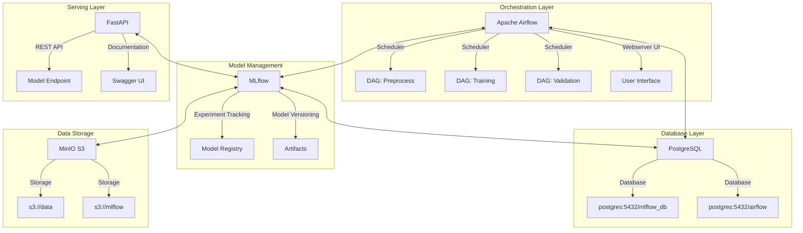

# Sistema MLOps para Predicción de Precios de Vehículos
### MLOps1 - CEIA - FIUBA

Estructura de servicios para implementación de un sistema completo de MLOps para predicción de precios de vehículos.

## Grupo de Trabajo
- Nicolas Pinzon Aparicio (a1820)
- Daniel Fernando Peña Pinzon (a1818)
- Cesar Raúl Alan Cruz Gutierrez (2544003)
- Federico Martin Zoya (a1828)

## Descripción del Proyecto

Este proyecto implementa un ambiente productivo para MLOps que consta de varios servicios desplegados mediante contenedores:

- **Apache Airflow**: Orquestación del pipeline ML (preprocesamiento, entrenamiento y validación)
- **MLflow**: Seguimiento de experimentos, registro y gestión de modelos
- **FastAPI**: API REST para servir modelos en producción
- **MinIO**: Almacenamiento compatible con S3 (data lake)
- **PostgreSQL**: Base de datos para Airflow y MLflow



## Requisitos Previos

- [Docker](https://docs.docker.com/engine/install/) y Docker Compose
- Git

## Instalación y Ejecución

1. Clonar este repositorio:
   ```bash
   git clone <url-del-repositorio>
   cd amq2-service-ml
   ```

2. Crear la estructura de directorios necesaria:
   ```bash
   mkdir -p airflow/config airflow/dags airflow/logs airflow/plugins airflow/secrets
   ```

3. Configurar el ID de usuario (solo para Linux/MacOS):
   - Editar el archivo `.env`
   - Reemplazar `AIRFLOW_UID` con tu ID de usuario: `id -u`

4. **Importante**: El puerto predeterminado para MLflow (5000) podría estar en uso. En ese caso, se ha modificado para usar el puerto 5001 en el archivo `.env` y `docker-compose.yaml`.

5. Iniciar todos los servicios:
   ```bash
   docker compose --profile all up
   ```

6. Acceder a los servicios:
   - **Apache Airflow**: http://localhost:8080 (usuario: airflow, contraseña: airflow)
   - **MLflow**: http://localhost:5001
   - **MinIO**: http://localhost:9001 (usuario: minio, contraseña: minio123)
   - **API**: http://localhost:8800/
   - **Documentación API**: http://localhost:8800/docs

## Pipeline de Datos y ML

El sistema implementa un flujo de trabajo completo en Airflow para la predicción de precios de vehículos en línea:

1. **Preprocesamiento**: Limpieza y transformación de datos de vehículos
2. **Entrenamiento**: Entrenamiento de modelos XGBoost, LightGBM, RandomForest y Ridge
3. **Validación**: Evaluación de precisión de los modelos

## Detener los Servicios

Para detener los servicios:
```bash
docker compose --profile all down
```

Para eliminar completamente la infraestructura (incluyendo volúmenes y datos):
```bash
docker compose down --rmi all --volumes
```

## Solución de Problemas

- **Puerto 5000 en uso**: Si encuentra un error relacionado con el puerto 5000, revise la configuración en `.env` y `docker-compose.yaml`. El servicio MLflow ahora usa el puerto 5001.
- **Problemas de permisos**: Verifique la configuración de AIRFLOW_UID en el archivo `.env`.

## Conexión con los Buckets

Para conectar con MinIO, configure las siguientes variables de entorno:

```bash
AWS_ACCESS_KEY_ID=minio
AWS_SECRET_ACCESS_KEY=minio123
AWS_ENDPOINT_URL_S3=http://localhost:9000
MLFLOW_S3_ENDPOINT_URL=http://localhost:9000
```

## Uso de MLflow

Este proyecto utiliza MLflow para el seguimiento de experimentos. Los artefactos se almacenan en el bucket `mlflow` en MinIO.
Dentro del experimento denominado "Modelos_Regresión", quedan registrados los modelos con sus métricas asociadas durante la fase de entrenamiento.

## Uso del Servicio implementado mediante FastAPI

Para acceder al servicio se ha creado un archivo denominado Prueba.html, el cual implementa un formulario para la carga de los datos de la consulta y un botón para efectuarla. Luego de consultar al modelo servido online, el precio de venta estimado por el modelo es mostrado en pantalla.
## IMPORTANTE! 
Es importante mencionar que los archivos .csv del dataset de trabajo, disponbiles en la carpeta /Datasets del proyecto, deben ser cargados manualmente y disponibles en el bucket "data" en MinIO antes de ejecutar el pipeline de trabajo, ya que los procesos intentarán descargarlos al momento de iniciar la ejecución del pipeline.

## Licencia

Ver archivo LICENSE para detalles.

## Capturas de Pantalla

### Airflow:


### Minio:


### MLFlow:


### Formulario de Test:


